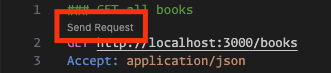

# Lesson 15 Starter

## Overview

In this exercise, you will explore how front-end applications communicate with backend services using RESTful APIs. You’ll simulate a REST API locally with **JSON Server**, and send requests using both a browser and a REST client (such as the **VS Code REST Client** extension). The focus is on understanding how APIs structure and return data and not on writing JavaScript code.

## Setup instructions

### 1. Create the project directory and initialize npm

```sh
mkdir lesson-15
cd lesson-15
npm init -y
```

This will create a `package.json` file with default values.

### 2. Install JSON server

```sh
npm install json-server
```

The [json-server](https://www.npmjs.com/package/json-server) package allows you to create a fully functional REST API from a simple JSON file.

### 3. Create the database file

Create a new file named `db.json` in the project directory with the following contents:

```json
{
  "books": [
    { "id": "1", "title": "The Legend of Hyrule", "author": "Zelda", "year": 2020, "genre": "Fantasy" },
    { "id": "2", "title": "The Hero's Journey", "author": "Link", "year": 2022, "genre": "Adventure" },
    { "id": "3", "title": "Chronicles of Ganon", "author": "Ganondorf", "year": 2021, "genre": "Epic" }
  ]
}
```

### 4. Createa a script and start the server

Add a `api-server` script to the `package.json` file:

```json
...
"scripts": {
  "api-server": "json-server --watch db.json --port 3000"
}
...
```

Run the script to start the API server:

```sh
npm run api-server
```

Once running, you’ll see available routes listed in the terminal. Test them in your browser:

- [http://localhost:3000/books](http://localhost:3000/books)  
- [http://localhost:3000/books/1](http://localhost:3000/books/1)

## Using browser and DevTools

The browser automatically sends **GET** requests when navigating to a URL.  
Use the **Network tab** in DevTools to inspect:

- Request method  
- URL and headers  
- Response status code (e.g., 200 OK)  
- JSON response body  

Try reloading the page and observing what happens.

## Using the REST Client (VS Code Extension)

1. Install the [REST Client](https://marketplace.visualstudio.com/items?itemName=humao.rest-client) VS Code extension.  
2. Create a new file named `requests.http` in the project directory.  
3. Add the following sample requests:

```http
### GET all books
GET http://localhost:3000/books
Accept: application/json

### POST new book
POST http://localhost:3000/books
Content-Type: application/json

{
  "title": "Tales of the Triforce",
  "author": "Impa",
  "year": 2023,
  "genre": "Lore"
}

### PATCH update a book
PATCH http://localhost:3000/books/2
Content-Type: application/json

{
  "author": "Link, the Hero of Time"
}

### DELETE a book
DELETE http://localhost:3000/books/3
```

4. Ensure that the server is still running, and if not, start the server and click the `Send Request` command in VS Code above any request to execute it (see image below).



5. View responses (status code, body, headers) directly in VS Code.

## HTTP status codes

| Code | Meaning | When It Appears |
|------|----------|------------------|
| 200  | OK | Successful GET, PUT, PATCH |
| 201  | Created | Successful POST |
| 400  | Bad Request | Invalid JSON format or missing fields |
| 404  | Not Found | Resource does not exist |
| 500  | Server Error | Internal JSON Server issue |

## Shutdown the server

You can shutdown the json-server using ctrl + c

```sh
ctrl + c
```

## Push to your GitHub workbook repo

Once you're done making your own custom updates to the project, stage your files, commit your work, and push to the remote repository.

1. Open a terminal in VS Code
2. Stage all updated and created files:
```sh
git add .
```
3. Commit the changes:
```sh
git commit -m 'Lesson 15 Example'
```
4. Push your changes to the remote workbook repository: 
```sh
git push origin main
```